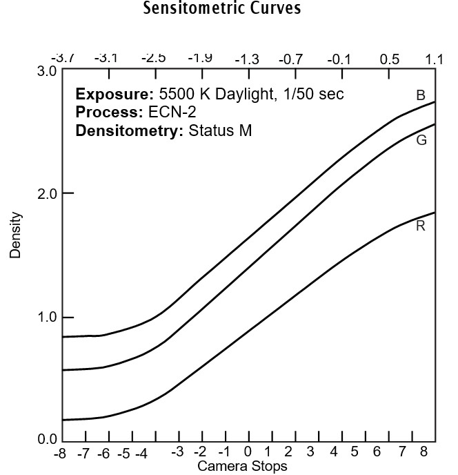

<p align="center">
  
</p>

<h1 align="center">Printroom</h1>

<p align="center">
  
  
  <a href="LICENSE"></a>
</p>

<p align="center">
  <a href="docs/user-guide.md">使用指南</a> ·
  <a href="#从源码构建">从源码构建</a> ·
  <a href="https://github.com/karasuyasabou/Printroom/issues">问题反馈</a>
</p>

<p align="center">
  
</p>

## 下载与安装

[下载 Printroom v1.0.0](https://github.com/karasuyasabou/Printroom/releases/tag/v1.0.0)

- **Apple Silicon（M 系列）**：下载 `Printroom-v1.0.0-macOS-arm64.zip`。
- **Intel**：下载 `Printroom-v1.0.0-macOS-x86_64.zip`。

解压后将 `Printroom.app` 拖入“应用程序”。应用未使用 Developer ID 签名或 Apple 公证；首次打开若被 macOS 拦截，请在尝试打开后前往“系统设置 → 隐私与安全性”，找到 Printroom 并选择“仍要打开”。

## 快速上手

### 1. 打开底片文件夹

在主页点击“打开底片”，选择存放底片的文件夹。支持线性 16-bit RGB TIFF 和 大部分品牌的 RAW；RAW 需要安装 [Adobe DNG Converter](https://helpx.adobe.com/camera-raw/using/adobe-dng-converter.html)。

### 2. 自动裁剪

点击顶部“自动裁剪”，选择底片的画幅比例，再开始分析。

完成后先检查裁框，尤其是首尾张、漏光或画面边缘不清楚的照片。裁剪应排除齿孔和扫描边框，后面的色罩分析才能只统计有效画面。

### 3. 框选片基

先确认右侧“01 矩阵矫正”中的 CMOS 和密度矩阵适合自己的翻拍设备。内置预设基本可以适配大多数相机和LED光源，可以直接使用。

点击“02 Film Base 对齐”中的“框选片基”，在照片边缘拖出一块未曝光、干净且均匀的区域，避开齿孔、文字、灰尘和漏光。

### 4. 色罩分析

点击顶部“色罩分析”，开始自动分析整卷色罩。完成后点击“应用到整卷”，获得一组基础调色参数。

若希望同时提亮曝光不足的照片，可以在开始前勾选“自动曝光”。这个选项默认关闭；夜景或刻意压暗的画面建议留到逐张调整。

### 5. 逐张精调

用 `←` / `→` 切换照片，在 Color Timing 的简易模式中调整曝光、色温和色调。有合适的灰色或白色物体时，按 `I` 开启中性点吸管，点击该区域辅助校正颜色。再按需要调整反差、选择 LUT，或用 `R` 微调裁剪。

完成后点击“导出”，选择照片、格式和输出色彩空间。编辑设置自动保存在底片文件夹的 `.printroom.json` 中。

### 常用快捷键

| 按键 | 简易调色模式 |
| --- | --- |
| `W` / `S` | 曝光增加／减少 |
| `Q` / `E` | 色温偏冷／偏暖 |
| `A` / `D` | 色调偏绿／偏洋红 |
| `I` | 开启／取消中性点吸管 |
| `[` / `]` | 向左／向右旋转 90° |

调色键可以长按连续调整，按住 `Shift` 再单次按键为十倍步进。

切换到 RGB 模式后，`W/S` 调 Master 增加／减少，`Q/E`、`A/D`、`Z/C` 分别调 Red、Green、Blue 减少／增加。按住 `Option`+ `W/S`，可调节亮度反差。

| 按键 | 裁剪模式 |
| --- | --- |
| `R` | 进入裁剪 |
| `W` / `S` / `A` / `D` | 裁框向上／下／左／右移动 |
| `Q` / `E` | 角度减少／增加 0.1° |

裁剪中切图会自动保存上一张的裁剪。快捷键帮助见应用内 `⌘⇧/` 或 [使用指南](docs/user-guide.md)。在文本框中输入时，字母键保留正常输入行为。

## 详细原理介绍

Printroom 以**密度操作为主**完成负片去色罩。线性域处理翻拍设备记录的通道数值，密度域处理数字 mask、配光和反差，最后由 LUT 将负片密度转换为可观看的正像。

```text
线性 RGB → CMOS 矩阵与片基增益 → 转为密度
        → 密度矩阵 → 片基对齐与 RGB Timing → RGB Contrast
        → Cineon Log LUT → 显示与导出
```

### Cineon CV、底片密度与 EV

Cineon 用 CV（Code Value，码值）表示密度。**1 CV 对应 0.002 密度变化**，因此增加 50 CV 就是增加 0.1 密度。

以 Kodak VISION3 250D 5207 为例（曲线来源：[Kodak 5207 技术资料](https://www.kodak.com/content/products-brochures/motion-picture/KODAK-VISION3-250D-5207-7207-technical-information.pdf)）：

<p align="center">
  
</p>

横轴的是拍摄曝光档数。纵轴是冲洗后的底片密度。按图粗读，线性段每档大约增加 0.16 密度，即每档约 80 CV。

#### Cineon 的黑、灰、白参考点

| 参考点 | 定义 | CV |
| --- | --- | ---: |
| 参考黑 | 黑位基准 | 95 |
| 18% 中灰 | 正常曝光的中性灰参考，用于配光 | 470 |
| 90% 漫反射白 | 正常曝光的白色漫反射物体，不含镜面高光 | 685 |

黑位设在 95 CV，白位设在 685 CV，分别在其下方和上方留出数值空间。685 CV 是漫反射白的参考位置，高于它仍可以记录更亮的高光；470 CV 则用于判断中灰的配光位置。

## 调色面板

下面按右侧面板的顺序说明。矩阵与片基是这组底片共用的校准，Timing、Contrast 和 LUT 则可以逐张调整。

### 01 · 矩阵矫正

**CMOS 矩阵**在线性域工作，校正翻拍光源与相机传感器组合造成的三通道串扰，与底片无关。更换光源或相机，需要重新确认校正。可以在“管理…”中用 R、G、B 三张光源标定图建立自己的矩阵。

**密度矩阵**在密度域工作，可以把它理解为数字 mask。彩色负片的色罩原本服务于光化学印相，一般为 RA-4 相纸，并非 **Status M**。相纸的感光谱响应与 LED 窄带光源翻拍得到的通道响应不同，原有色罩在数字流程中存在差异。密度矩阵用于补偿这类光谱差异带来的色罩偏移。

关于光源校正和数字 mask 的思路，可以参考 [DiVERE](https://github.com/V7CN/DiVERE) 的说明。Printroom 中两种矩阵分属不同阶段，选择时需要分别考虑；内置密度矩阵为 （450nm, 535nm, 660nm）的LED光源对应矩阵，适合大部分胶卷。也可以录入自定义系数。

### 02 · Film Base 对齐

片基取样用未曝光区域建立调色基准，把不同通道的起点对齐。框选后会将这块区域对齐到 95 CV，作为调色起始点。

**片基取样不作为物理 Dmin。** Dmin 是特定曝光、冲洗和密度测量条件下的最小密度，包含片基与灰雾。这里框选的区域用于校准；对齐到 95 CV 是工作流程的参考位置，不表示设置了底片的绝对 Dmin。

### 03 · Color Timing

RGB Timing 对应 Cineon 配光流程，通过密度偏移模拟改变 R、G、B 的印光时间。Master 同时移动三个通道，RGB 分别控制通道偏移，用于调整亮度和颜色平衡。

**简易模式与 RGB 模式完全等效**。简易模式将其整理为曝光、色温、色调；RGB 模式直接操作 Master、Red、Green、Blue。选择顺手的一种即可，可随时切换。

配光以 Cineon 的 **18% 中灰约 470 CV、漫反射白约 680 CV** 为参考；Printroom 的白点参考值为 **685 CV**。这些位置帮助确定密度与输出的对应关系，可在直方图中选择密度选项，查看密度分布直方图。

### 04 · RGB Contrast

Master 调整整体亮度反差，Red、Green、Blue 分别调整通道反差。调节围绕 685 CV 参考白点展开，直观感受就是修正了暗部偏色。

曝光和冲洗正常、矩阵矫正正确时，认为获得了 **“完美底片”**，理论上无需调节通道反差。如果冲洗出严重问题，直观感受就是白平衡调整完成后暗部发生偏色，可以通过通道反差修正一部分回来。不同通道反差会改变灰阶中的颜色关系，也可以用于美学调整。

### 05 · Cineon Log LUT

LUT 将调节后的负片密度转换为输出预览，决定正像的明暗曲线、色彩和印片外观。内置 Kodak 2383 与 Fujifilm 3513DI。

公式、常量和完整阶段定义以 [算法与色彩管线](docs/pipeline.md) 为准。

## 自动裁剪与色罩分析

上述5步管线可以手动操作，也可以用下面介绍的自动工具进行辅助分析。

### 自动裁剪

自动裁剪先根据这些照片的边缘估计共同画幅大小，再分别确定每张的裁框位置与小角度旋转。运行前选好画幅比例。边缘不明确或扫描范围不足的照片会进入待检查流程，调整后用“确认并下一张”或 `Enter` 继续。

### 色罩分析

色罩分析统计**裁剪后**的有效画面，为这些底片求出一组共用的 RGB Timing，作为去色罩与配光的起点，再由你逐张精调。

分析前完成**片基取样**，并尽量排除边框。应用时会统一目标照片的 LUT，并将反差恢复为 1。若要保留已有精调，在结果窗口勾选“保留已调色”，改过 Timing 或 Contrast 的照片会被保护。

可选的“自动曝光”在基础 RGB Timing 之后逐张分析曝光。它依据画面统计工作，低调或夜景可能被提亮，仍需检查。

同步调色、齿孔置白、输出设置和保存恢复等操作见 [使用指南](docs/user-guide.md)。

## 运行要求

- **macOS 14 或更新版本**，提供 Apple Silicon 和 Intel 两种安装包。
- **RAW** 需要安装 `/Applications/Adobe DNG Converter.app`。

## 从源码构建

安装 Xcode 和命令行工具，使用 Swift 6 工具链：

```sh
git clone https://github.com/karasuyasabou/Printroom.git
cd Printroom
scripts/build-app.sh
```

构建结果为 `output/Printroom.app`。脚本在资源和本地签名验证成功后替换同一路径的旧应用。项目使用 SwiftPM，也可在 Xcode 中打开 `Package.swift`。

开发与验证说明见 [参与开发](CONTRIBUTING.md)。如遇问题，欢迎提交 [Issue](https://github.com/karasuyasabou/Printroom/issues)，附上系统版本、输入格式与复现步骤。

## 项目支持

项目由个人持续维护，若对后期工作流程有帮助，可以支持作者：

<p align="center">
  
</p>

## 许可

Printroom 原创代码与文档采用 **GNU GPL 第三版（GPL-3.0-only）**，详见 [LICENSE](LICENSE)。第三方组件保留各自声明，见 [第三方说明](THIRD_PARTY_NOTICES.md)。
