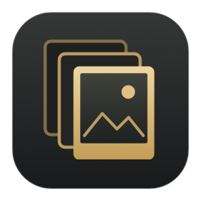
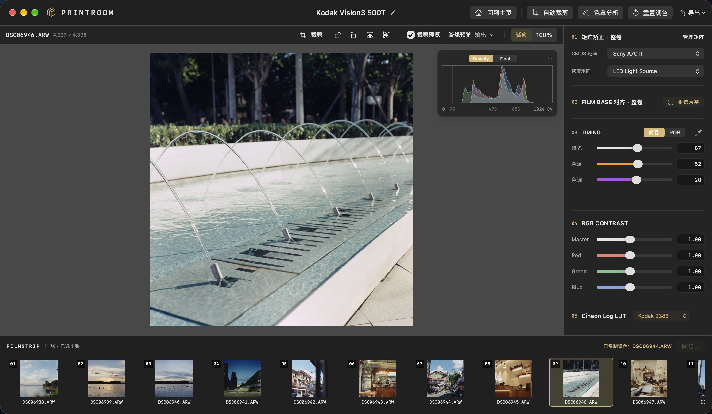
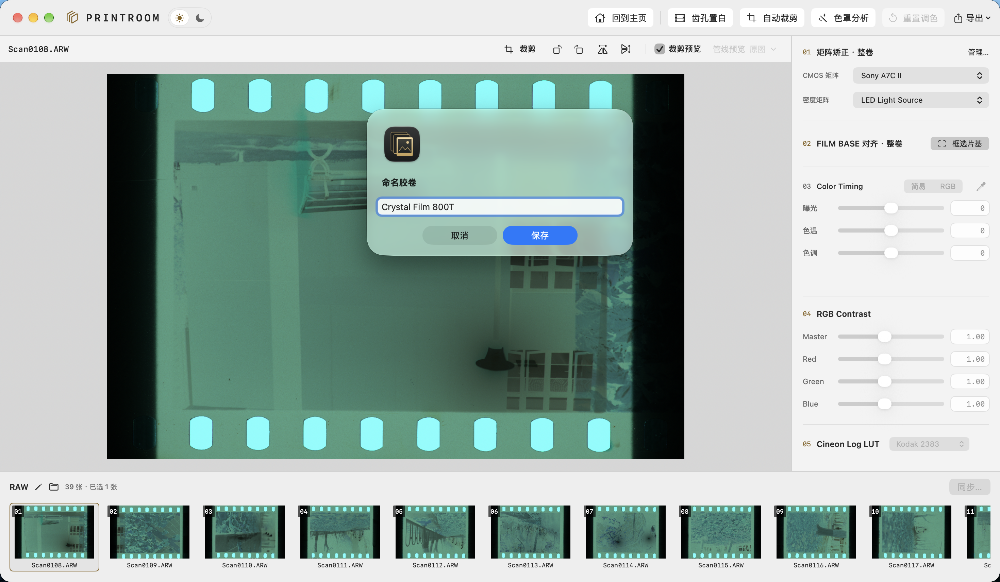
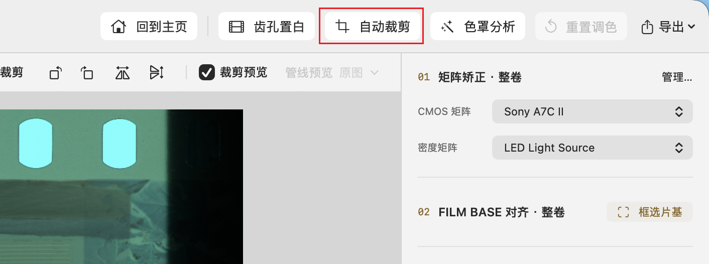
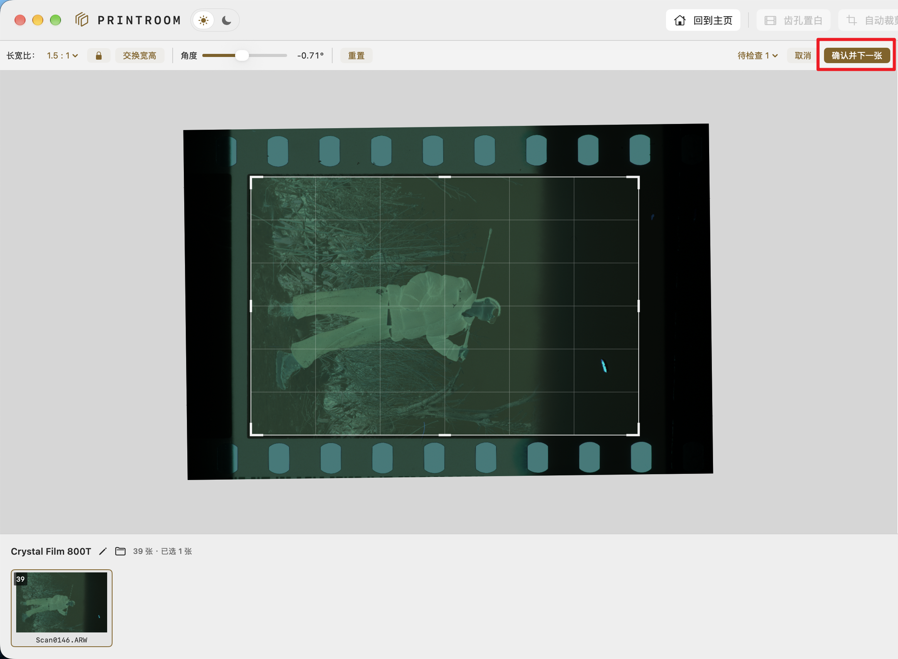
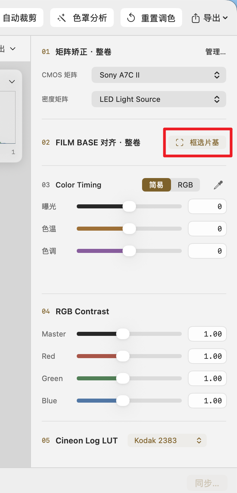
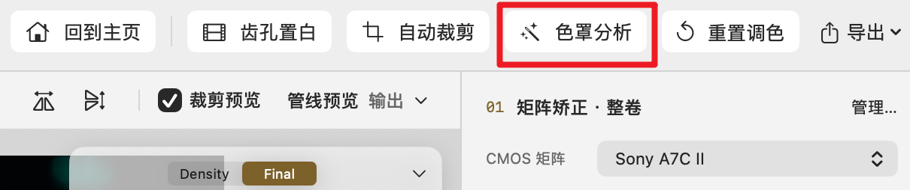

<p align="center">
  
</p>

<h1 align="center">Printroom</h1>

<p align="center">macOS 原生负片调色工具，从整卷片基校准、逐帧调色到批量导出。</p>

<p align="center">
  
  
  <a href="LICENSE"></a>
</p>

<p align="center">
  <a href="docs/user-guide.md">使用指南</a> ·
  <a href="#从源码构建">从源码构建</a> ·
  <a href="https://github.com/karasuyasabou/Printroom/issues">问题反馈</a>
</p>

<p align="center">
  
</p>

## 下载与安装

要求 **macOS 14 或更新版本**。

[下载 Printroom v1.0.2](https://github.com/karasuyasabou/Printroom/releases/tag/v1.0.2)

- **Apple Silicon（M 系列）**：下载 `Printroom-v1.0.2-macOS-arm64.zip`。
- **Intel**：下载 `Printroom-v1.0.2-macOS-x86_64.zip`。

解压后将 `Printroom.app` 拖入“应用程序”。应用未使用 Developer ID 签名或 Apple 公证；首次打开若被 macOS 拦截，请在尝试打开后前往“系统设置 → 隐私与安全性”，找到 Printroom 并选择“仍要打开”。

RAW 输入需要另行安装 [Adobe DNG Converter](https://helpx.adobe.com/camera-raw/using/adobe-dng-converter.html)；TIFF 不依赖 Adobe。

## 主要功能

- **按卷管理**：支持线性 16-bit RGB TIFF 与常见品牌 RAW，编辑设置自动保存，原片保持不变。
- **校准与调色**：卷级矩阵、片基校准、色罩分析，逐帧 Timing / Contrast 与中性点吸管。
- **印片外观**：内置 Kodak 2383 与 Fujifilm 3513DI。
- **批量处理**：自动及手动裁剪、齿孔置白、多选同步、整组撤销，以及五种色彩空间的 TIFF / JPG 导出。

## 快速开始

### 1. 打开并命名胶卷

在主页点击“打开底片”，选择存放这一卷照片的文件夹。加载完成后可为胶卷命名。

<p align="center">
  
</p>

### 2. 自动裁剪并检查画幅

点击顶部“自动裁剪”，选择底片的画幅比例并开始分析。裁框应排除齿孔和扫描边框，让后续色罩分析只统计有效画面。

<p align="center">
  
</p>

若有待检查照片，拖动裁框或微调角度（快捷键 `W、A、S、D、Q、E`），再点击“确认并下一张”。完成后也可以按 `R` 随时调整当前照片的裁剪。

<p align="center">
  
</p>

### 3. 框选片基

点击“框选片基”。在照片边缘选取一块未曝光、干净且均匀的区域，避开齿孔、文字、灰尘；

<p align="center">
  
</p>

### 4. 分析整卷色罩

点击顶部“色罩分析”，完成后选择“应用到整卷”，获得一组基础调色参数。可选“自动曝光”调整逐张曝光，否则整卷曝光保持一致。

<p align="center">
  
</p>

### 5. 逐张精调并导出

用 `←` / `→` 切换照片，在简易模式中调整曝光、色温和色调，再按需要调整反差。有合适的中性区域时，按 `I` 开启吸管辅助校色。

完成后点击“导出”，再设置格式和色彩空间；单选时即可导出当前照片。

完整操作、支持格式、快捷键和调色原理见 **[使用指南](docs/user-guide.md)**。

## 从源码构建

安装 Xcode 和命令行工具，使用 Swift 6 工具链：

```sh
git clone https://github.com/karasuyasabou/Printroom.git
cd Printroom
scripts/build-app.sh
```

构建结果为 `output/Printroom.app`，也可在 Xcode 中打开 `Package.swift`。

开发与验证说明见 [参与开发](CONTRIBUTING.md)。如遇问题，欢迎提交 [Issue](https://github.com/karasuyasabou/Printroom/issues)，附上系统版本、输入格式与复现步骤。

## 项目支持

项目由个人持续维护，若对后期工作流程有帮助，可以支持作者：

<p align="center">
  
</p>

## 许可

Printroom 原创代码与文档采用 **GNU GPL 第三版（GPL-3.0-only）**，详见 [LICENSE](LICENSE)。第三方组件保留各自声明，见 [第三方说明](THIRD_PARTY_NOTICES.md)。
